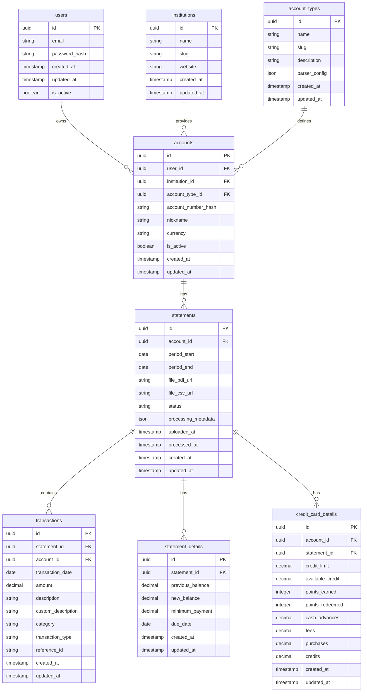

# 🗄️ Ledgerly Database Schema

## Overview

This document defines the PostgreSQL database schema for Ledgerly. The design supports multi-institution, multi-account financial data management with extensibility for future features.

**Database**: PostgreSQL 15+
**ORM**: SQLAlchemy 2.0+ with async support
**Migration Tool**: Alembic

---

## 🏗️ Schema Design Principles

1. **Normalization**: 3NF compliance with strategic denormalization for performance
2. **Extensibility**: Support for multiple institutions and account types
3. **Data Integrity**: Foreign key constraints and check constraints
4. **Performance**: Strategic indexes for common query patterns
5. **Audit Trail**: Created/updated timestamps on all entities
6. **UUID Primary Keys**: For security and distributed system compatibility

---

## 📊 Entity Relationship Diagram



---

## 🔧 Table Definitions

### **users**

User accounts and authentication.

```sql
CREATE TABLE users (
    id UUID PRIMARY KEY DEFAULT gen_random_uuid(),
    email VARCHAR(255) UNIQUE NOT NULL,
    password_hash VARCHAR(255) NOT NULL,
    created_at TIMESTAMP WITH TIME ZONE DEFAULT CURRENT_TIMESTAMP,
    updated_at TIMESTAMP WITH TIME ZONE DEFAULT CURRENT_TIMESTAMP,
    is_active BOOLEAN DEFAULT true,

    CONSTRAINT users_email_valid CHECK (email ~* '^[A-Za-z0-9._%+-]+@[A-Za-z0-9.-]+\.[A-Za-z]{2,}$')
);

CREATE INDEX idx_users_email ON users(email);
CREATE INDEX idx_users_active ON users(is_active);
```

---

### **institutions**

Financial institutions (banks, credit card companies).

```sql
CREATE TABLE institutions (
    id UUID PRIMARY KEY DEFAULT gen_random_uuid(),
    name VARCHAR(255) NOT NULL,
    slug VARCHAR(100) UNIQUE NOT NULL,
    website VARCHAR(255),
    logo_url VARCHAR(255),
    created_at TIMESTAMP WITH TIME ZONE DEFAULT CURRENT_TIMESTAMP,
    updated_at TIMESTAMP WITH TIME ZONE DEFAULT CURRENT_TIMESTAMP,

    CONSTRAINT institutions_slug_format CHECK (slug ~* '^[a-z0-9_-]+$')
);

CREATE INDEX idx_institutions_slug ON institutions(slug);

-- Default institutions
INSERT INTO institutions (id, name, slug, website) VALUES
    ('550e8400-e29b-41d4-a716-446655440000', 'Citibank', 'citi', 'https://www.citi.com'),
    ('550e8400-e29b-41d4-a716-446655440001', 'Chase', 'chase', 'https://www.chase.com'),
    ('550e8400-e29b-41d4-a716-446655440002', 'Bank of America', 'boa', 'https://www.bankofamerica.com');
```

---

### **account_types**

Account type definitions and parser configurations.

```sql
CREATE TABLE account_types (
    id UUID PRIMARY KEY DEFAULT gen_random_uuid(),
    name VARCHAR(255) NOT NULL,
    slug VARCHAR(100) UNIQUE NOT NULL,
    description TEXT,
    parser_config JSONB NOT NULL DEFAULT '{}',
    created_at TIMESTAMP WITH TIME ZONE DEFAULT CURRENT_TIMESTAMP,
    updated_at TIMESTAMP WITH TIME ZONE DEFAULT CURRENT_TIMESTAMP,

    CONSTRAINT account_types_slug_format CHECK (slug ~* '^[a-z0-9_-]+$')
);

CREATE INDEX idx_account_types_slug ON account_types(slug);
CREATE INDEX idx_account_types_parser_config ON account_types USING GIN (parser_config);

-- Default account types
INSERT INTO account_types (id, name, slug, description, parser_config) VALUES
    ('660e8400-e29b-41d4-a716-446655440000', 'Credit Card', 'credit_card', 'Standard credit card account', '{"supports_pdf": true, "supports_csv": true}'),
    ('660e8400-e29b-41d4-a716-446655440001', 'Checking Account', 'checking', 'Standard checking account', '{"supports_pdf": true, "supports_csv": true}'),
    ('660e8400-e29b-41d4-a716-446655440002', 'Savings Account', 'savings', 'Standard savings account', '{"supports_pdf": true, "supports_csv": true}');
```

---

### **accounts**

User's financial accounts.

```sql
CREATE TABLE accounts (
    id UUID PRIMARY KEY DEFAULT gen_random_uuid(),
    user_id UUID NOT NULL REFERENCES users(id) ON DELETE CASCADE,
    institution_id UUID NOT NULL REFERENCES institutions(id) ON DELETE RESTRICT,
    account_type_id UUID NOT NULL REFERENCES account_types(id) ON DELETE RESTRICT,
    account_number_hash VARCHAR(255) NOT NULL, -- Hashed for security
    nickname VARCHAR(255),
    currency VARCHAR(3) DEFAULT 'USD',
    is_active BOOLEAN DEFAULT true,
    created_at TIMESTAMP WITH TIME ZONE DEFAULT CURRENT_TIMESTAMP,
    updated_at TIMESTAMP WITH TIME ZONE DEFAULT CURRENT_TIMESTAMP,

    CONSTRAINT accounts_currency_valid CHECK (currency ~* '^[A-Z]{3}$'),
    UNIQUE(user_id, account_number_hash)
);

CREATE INDEX idx_accounts_user_id ON accounts(user_id);
CREATE INDEX idx_accounts_institution_id ON accounts(institution_id);
CREATE INDEX idx_accounts_account_type_id ON accounts(account_type_id);
CREATE INDEX idx_accounts_active ON accounts(is_active);
```

---

### **statements**

Financial statement periods and metadata.

```sql
CREATE TABLE statements (
    id UUID PRIMARY KEY DEFAULT gen_random_uuid(),
    account_id UUID NOT NULL REFERENCES accounts(id) ON DELETE CASCADE,
    period_start DATE NOT NULL,
    period_end DATE NOT NULL,
    file_pdf_url VARCHAR(255),
    file_csv_url VARCHAR(255),
    status VARCHAR(50) DEFAULT 'pending',
    processing_metadata JSONB DEFAULT '{}',
    uploaded_at TIMESTAMP WITH TIME ZONE DEFAULT CURRENT_TIMESTAMP,
    processed_at TIMESTAMP WITH TIME ZONE,
    created_at TIMESTAMP WITH TIME ZONE DEFAULT CURRENT_TIMESTAMP,
    updated_at TIMESTAMP WITH TIME ZONE DEFAULT CURRENT_TIMESTAMP,

    CONSTRAINT statements_period_valid CHECK (period_end >= period_start),
    CONSTRAINT statements_status_valid CHECK (status IN ('pending', 'processing', 'completed', 'failed')),
    CONSTRAINT statements_files_required CHECK (file_pdf_url IS NOT NULL OR file_csv_url IS NOT NULL),
    UNIQUE(account_id, period_start, period_end)
);

CREATE INDEX idx_statements_account_id ON statements(account_id);
CREATE INDEX idx_statements_period ON statements(period_start, period_end);
CREATE INDEX idx_statements_status ON statements(status);
CREATE INDEX idx_statements_uploaded_at ON statements(uploaded_at);
CREATE INDEX idx_statements_processing_metadata ON statements USING GIN (processing_metadata);
```

---

### **statement_details**

Statement balance and payment information.

```sql
CREATE TABLE statement_details (
    id UUID PRIMARY KEY DEFAULT gen_random_uuid(),
    statement_id UUID UNIQUE NOT NULL REFERENCES statements(id) ON DELETE CASCADE,
    previous_balance DECIMAL(12,2),
    new_balance DECIMAL(12,2),
    minimum_payment DECIMAL(12,2),
    due_date DATE,
    created_at TIMESTAMP WITH TIME ZONE DEFAULT CURRENT_TIMESTAMP,
    updated_at TIMESTAMP WITH TIME ZONE DEFAULT CURRENT_TIMESTAMP
);

CREATE INDEX idx_statement_details_statement_id ON statement_details(statement_id);
CREATE INDEX idx_statement_details_due_date ON statement_details(due_date);
```

---

### **transactions**

Individual financial transactions.

```sql
CREATE TABLE transactions (
    id UUID PRIMARY KEY DEFAULT gen_random_uuid(),
    statement_id UUID NOT NULL REFERENCES statements(id) ON DELETE CASCADE,
    account_id UUID NOT NULL REFERENCES accounts(id) ON DELETE CASCADE,
    transaction_date DATE NOT NULL,
    amount DECIMAL(12,2) NOT NULL,
    description TEXT NOT NULL,
    custom_description TEXT,
    category VARCHAR(100),
    transaction_type VARCHAR(50) NOT NULL,
    reference_id VARCHAR(255), -- External transaction ID
    created_at TIMESTAMP WITH TIME ZONE DEFAULT CURRENT_TIMESTAMP,
    updated_at TIMESTAMP WITH TIME ZONE DEFAULT CURRENT_TIMESTAMP,

    CONSTRAINT transactions_type_valid CHECK (transaction_type IN ('debit', 'credit', 'payment', 'refund')),
    CONSTRAINT transactions_amount_not_zero CHECK (amount != 0)
);

CREATE INDEX idx_transactions_statement_id ON transactions(statement_id);
CREATE INDEX idx_transactions_account_id ON transactions(account_id);
CREATE INDEX idx_transactions_date ON transactions(transaction_date);
CREATE INDEX idx_transactions_amount ON transactions(amount);
CREATE INDEX idx_transactions_category ON transactions(category);
CREATE INDEX idx_transactions_type ON transactions(transaction_type);
CREATE INDEX idx_transactions_description_search ON transactions USING GIN (to_tsvector('english', description));
CREATE INDEX idx_transactions_custom_description_search ON transactions USING GIN (to_tsvector('english', custom_description));
```

---

### **credit_card_details**

Credit card specific information.

```sql
CREATE TABLE credit_card_details (
    id UUID PRIMARY KEY DEFAULT gen_random_uuid(),
    account_id UUID NOT NULL REFERENCES accounts(id) ON DELETE CASCADE,
    statement_id UUID UNIQUE NOT NULL REFERENCES statements(id) ON DELETE CASCADE,
    credit_limit DECIMAL(12,2),
    available_credit DECIMAL(12,2),
    points_earned INTEGER DEFAULT 0,
    points_redeemed INTEGER DEFAULT 0,
    cash_advances DECIMAL(12,2) DEFAULT 0,
    fees DECIMAL(12,2) DEFAULT 0,
    purchases DECIMAL(12,2) DEFAULT 0,
    credits DECIMAL(12,2) DEFAULT 0,
    created_at TIMESTAMP WITH TIME ZONE DEFAULT CURRENT_TIMESTAMP,
    updated_at TIMESTAMP WITH TIME ZONE DEFAULT CURRENT_TIMESTAMP,

    CONSTRAINT cc_details_credit_limit_positive CHECK (credit_limit >= 0),
    CONSTRAINT cc_details_available_credit_valid CHECK (available_credit <= credit_limit),
    CONSTRAINT cc_details_points_non_negative CHECK (points_earned >= 0 AND points_redeemed >= 0)
);

CREATE INDEX idx_cc_details_account_id ON credit_card_details(account_id);
CREATE INDEX idx_cc_details_statement_id ON credit_card_details(statement_id);
```

---

## 🔍 Views and Functions

### **account_summary_view**

Consolidated account information with latest statement data.

```sql
CREATE VIEW account_summary_view AS
SELECT
    a.id,
    a.nickname,
    i.name as institution_name,
    at.name as account_type_name,
    a.currency,
    a.is_active,
    latest_stmt.period_end as last_statement_date,
    latest_details.new_balance as current_balance,
    latest_cc.available_credit,
    latest_cc.credit_limit
FROM accounts a
JOIN institutions i ON a.institution_id = i.id
JOIN account_types at ON a.account_type_id = at.id
LEFT JOIN LATERAL (
    SELECT * FROM statements s
    WHERE s.account_id = a.id
    ORDER BY s.period_end DESC
    LIMIT 1
) latest_stmt ON true
LEFT JOIN statement_details latest_details ON latest_details.statement_id = latest_stmt.id
LEFT JOIN credit_card_details latest_cc ON latest_cc.statement_id = latest_stmt.id;
```

### **monthly_spending_summary**

Function for monthly spending analysis.

```sql
CREATE OR REPLACE FUNCTION get_monthly_spending(
    p_account_id UUID,
    p_year INTEGER,
    p_month INTEGER DEFAULT NULL
)
RETURNS TABLE(
    category VARCHAR,
    amount DECIMAL,
    transaction_count BIGINT,
    percentage DECIMAL
) AS $$
BEGIN
    RETURN QUERY
    WITH spending_data AS (
        SELECT
            COALESCE(t.category, 'uncategorized') as cat,
            SUM(t.amount) as total_amount,
            COUNT(*) as tx_count
        FROM transactions t
        JOIN statements s ON t.statement_id = s.id
        WHERE t.account_id = p_account_id
        AND EXTRACT(YEAR FROM t.transaction_date) = p_year
        AND (p_month IS NULL OR EXTRACT(MONTH FROM t.transaction_date) = p_month)
        AND t.amount < 0  -- Only spending (negative amounts)
        GROUP BY COALESCE(t.category, 'uncategorized')
    ),
    total_spending AS (
        SELECT SUM(total_amount) as grand_total
        FROM spending_data
    )
    SELECT
        sd.cat::VARCHAR,
        sd.total_amount,
        sd.tx_count,
        ROUND((sd.total_amount / ts.grand_total * 100), 2)
    FROM spending_data sd
    CROSS JOIN total_spending ts
    ORDER BY sd.total_amount ASC;  -- Most negative (highest spending) first
END;
$$ LANGUAGE plpgsql;
```

---

## 🚀 Migration Strategy

### **Phase 1: Core Tables**

1. Create `users`, `institutions`, `account_types` tables
2. Insert default data for institutions and account types
3. Create `accounts` table with foreign key relationships

### **Phase 2: Statement Management**

1. Create `statements` table with processing status tracking
2. Create `statement_details` table for balance information
3. Add file storage URL columns and processing metadata

### **Phase 3: Transactions**

1. Create `transactions` table with full-text search indexes
2. Add category and transaction type constraints
3. Create performance indexes for common query patterns

### **Phase 4: Specialized Details**

1. Create `credit_card_details` table for credit card specific data
2. Add extensibility for other account type details tables
3. Create views and functions for common aggregations

### **Phase 5: Optimization**

1. Add materialized views for heavy analytical queries
2. Implement partitioning for transactions table (by date)
3. Add advanced indexing strategies

---

## 🔧 Performance Considerations

### **Indexing Strategy**

- **Primary Access**: UUID primary keys with B-tree indexes
- **Foreign Keys**: All foreign key columns indexed
- **Date Ranges**: Composite indexes on date columns for period queries
- **Search**: GIN indexes for full-text search on descriptions
- **Analytics**: Specialized indexes for category and amount filtering

### **Partitioning**

```sql
-- Future: Partition transactions by month for better performance
CREATE TABLE transactions (
    -- columns same as above
) PARTITION BY RANGE (transaction_date);

-- Create monthly partitions
CREATE TABLE transactions_2025_01 PARTITION OF transactions
    FOR VALUES FROM ('2025-01-01') TO ('2025-02-01');
```

### **Data Archival**

```sql
-- Archive old transactions (>7 years) to separate tables
CREATE TABLE transactions_archive (LIKE transactions INCLUDING ALL);

-- Move old data
INSERT INTO transactions_archive
SELECT * FROM transactions
WHERE transaction_date < CURRENT_DATE - INTERVAL '7 years';
```

---

## 🛡️ Security Considerations

### **Data Encryption**

- Account numbers stored as SHA-256 hashes
- Sensitive data encrypted at rest using PostgreSQL TDE
- Connection encryption enforced (SSL/TLS)

### **Access Control**

```sql
-- Row Level Security for multi-tenant isolation
ALTER TABLE accounts ENABLE ROW LEVEL SECURITY;
ALTER TABLE statements ENABLE ROW LEVEL SECURITY;
ALTER TABLE transactions ENABLE ROW LEVEL SECURITY;

-- Policy: Users can only see their own data
CREATE POLICY user_accounts_policy ON accounts
    FOR ALL TO app_user
    USING (user_id = current_setting('app.current_user_id')::uuid);

CREATE POLICY user_statements_policy ON statements
    FOR ALL TO app_user
    USING (account_id IN (
        SELECT id FROM accounts
        WHERE user_id = current_setting('app.current_user_id')::uuid
    ));
```

### **Audit Trail**

```sql
-- Audit table for sensitive operations
CREATE TABLE audit_log (
    id UUID PRIMARY KEY DEFAULT gen_random_uuid(),
    table_name VARCHAR(255) NOT NULL,
    record_id UUID NOT NULL,
    action VARCHAR(50) NOT NULL,
    old_values JSONB,
    new_values JSONB,
    user_id UUID,
    timestamp TIMESTAMP WITH TIME ZONE DEFAULT CURRENT_TIMESTAMP
);
```

---

## 📊 Sample Data

```sql
-- Sample user
INSERT INTO users (id, email, password_hash) VALUES
    ('user-uuid-1', 'demo@ledgerly.com', 'hashed_password_here');

-- Sample account
INSERT INTO accounts (id, user_id, institution_id, account_type_id, account_number_hash, nickname) VALUES
    ('account-uuid-1', 'user-uuid-1', '550e8400-e29b-41d4-a716-446655440000', '660e8400-e29b-41d4-a716-446655440000', 'hash_of_account_number', 'My Citi Card');

-- Sample statement
INSERT INTO statements (id, account_id, period_start, period_end, status) VALUES
    ('stmt-uuid-1', 'account-uuid-1', '2025-08-01', '2025-08-31', 'completed');

-- Sample transactions
INSERT INTO transactions (statement_id, account_id, transaction_date, amount, description, category, transaction_type) VALUES
    ('stmt-uuid-1', 'account-uuid-1', '2025-08-15', -125.50, 'WHOLE FOODS MARKET', 'groceries', 'debit'),
    ('stmt-uuid-1', 'account-uuid-1', '2025-08-16', -45.20, 'SHELL GAS STATION', 'gas', 'debit'),
    ('stmt-uuid-1', 'account-uuid-1', '2025-08-17', 150.00, 'REFUND AMAZON', 'refunds', 'credit');
```

---

_Last Updated: September 6, 2025_
_Schema Version: 1.0_
